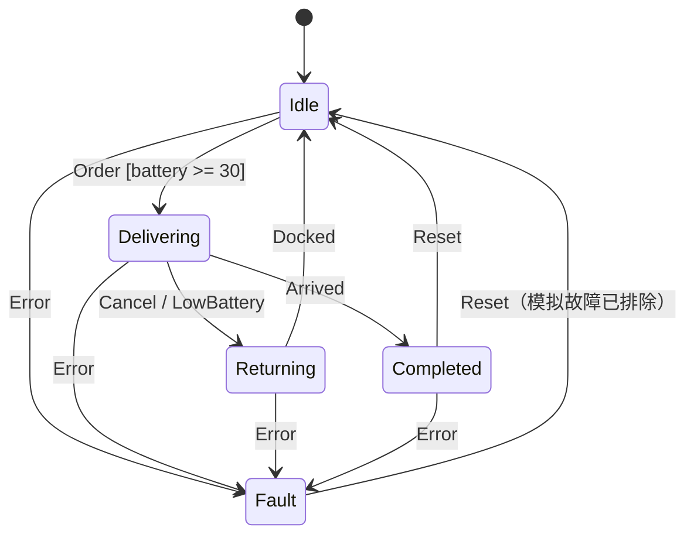

# 状态机：给配送订单一张明确的进度表

位置：[主线](../00_course_map.md)顺序 3。前一站：[ROS 2 基础](../15_ros2_basics/README.md)；下一站：[Lifecycle](../17_lifecycle/README.md)。

状态：入门正文与纯 C++ 演示可用；分层状态机和 ROS action 接入是后续练习。

## 第一遍读法与先记三件事

先看故事和转移表，再运行实验。第一遍不用引入状态机框架、模板元编程或多线程。

1. 状态（State）回答“现在处于哪一步”。
2. 事件（Event）回答“刚刚发生了什么”；守卫条件（Guard）决定现在能否转移。
3. 转移（Transition）要写清来源、条件、目标和副作用；未允许的组合也要有规定。

有限状态机（Finite State Machine，FSM）就是有限个状态加上这些转移规则。像订单的“待接单、配送中、已交付”，但类比有边界：现实可能同时发生多件事，初学实验会先用单线程按顺序处理事件。

## 从三个 bool 走到一张表

假设代码里有 `is_delivering`、`is_returning`、`has_fault`。三个变量能组合出八种值，其中“配送和返航同时为真”该怎么处理？如果约定同一时刻只有一个任务模式，用一个 `enum class State` 表示，会把规则集中起来。

本实验的五个状态：`Idle` 空闲、`Delivering` 配送、`Returning` 返航、`Completed` 完成、`Fault` 故障。电量是上下文数据，不为每一个百分比创建一个新状态。



图中的 `Cancel / LowBattery` 表示两种可触发事件，不是 UML 的“事件/动作”记法。这里只演示取消后返航这一种业务策略。

| 当前状态 | 事件 | 条件 | 下一个状态 | 本例行为 |
|---|---|---|---|---|
| Idle | Order | 电量 ≥ 30% | Delivering | 接单并记录状态变化 |
| Idle | Order | 电量 < 30% | Idle | 拒单并打印 `REJECT` |
| Delivering | Arrived | 无 | Completed | 标记交付完成 |
| Delivering | Cancel 或 LowBattery | 无 | Returning | 标记返航 |
| Returning | Docked | 无 | Idle | 回到等待接单 |
| 非 Fault | Error | 无 | Fault | 进入故障模式 |
| Completed 或 Fault | Reset | 本例假定允许复位 | Idle | 清除任务模式 |
| 其他组合 | 任意事件 | 未定义有效转移 | 原状态 | 打印 `IGNORE`，不悄悄跳转 |

状态变化的副作用在本实验只是日志，不会发真实导航或底盘命令。真实机器人从配送转返航前，需要先请求取消旧目标并确认停止；这会引出后面的 `Canceling` 中间状态。

## 动手：先预测，再看每一行

从仓库根目录，使用 Linux、CMake 和 C++17 编译器：

```bash
cmake -S labs/task_orchestration -B build/task_orchestration
cmake --build build/task_orchestration --parallel 2
build/task_orchestration/fsm_delivery
```

构建命令把[演示代码](../../labs/task_orchestration/fsm_delivery.cpp)编译成普通程序。程序内按固定顺序喂入事件，不需要第二个终端、ROS 或硬件。

运行前猜想：空闲时收到 `Arrived` 会不会“完成订单”？故障时收到新订单会不会继续走？低电量拒单之后，提升电量再接单是否成功？

预期看到 `IGNORE Idle + Arrived`、低电量 `REJECT`，以及 `Delivering → Returning → Idle`、`Delivering → Completed`、`Fault → Idle` 等转移。英文箭头在终端用 `->` 表示，电量值由代码固定。

**可证伪判断**：非法事件后状态必须不变；返航时不能被新订单切回配送。如果看到这种跳转，规则或实现就有问题，不能因为最后回到 Idle 就认为通过。

**修改练习**：把接单门槛 30 改为 50，先预测电量为 20、29、30、50 时的结果，再运行。程序自带针对原门槛的逐步检查，修改规则后旧检查应失败；按新规则更新输入和预期，再确认通过，不要删除检查。进阶时给取消加 `Canceling`，只有收到 `CancelConfirmed` 才进入 `Returning`；取消超时进入明确的故障处理，不直接发第二个导航目标。

**异常与清理**：找不到程序通常是目录或构建步骤不对；程序应自行结束，不应一直等待。只生成 `build/task_orchestration` 中的构建文件，没有 socket、ROS 节点或后台任务要清理。

## 第二遍：为什么还需要层级和事件队列

状态一多，许多状态会重复写“出现故障怎么办”。分层状态机（Hierarchical State Machine，HSM）可以把 `Delivering` 和 `Returning` 放在 `Working` 父状态下，共享部分事件处理。这适合表达模式层级，但必须明确父子状态谁优先处理事件。

进入 ROS 后，电量订阅、action 结果和取消请求可能由不同回调产生。推荐练习先让回调只投递事件，由一个任务执行入口统一更新 FSM；队列要有容量、溢出策略和事件优先级。另一条路是同步保护状态，但不能只给 `state` 加锁却忘了目标 ID、超时和副作用的一致性。

真实事件还应携带任务 ID。旧任务的迟到 `Arrived` 不能完成新任务。重复 `Cancel` 应有稳定结果；Fault 的 `Reset` 应检查故障是否排除，而不是无限自动复位。这些是综合练习的要求，当前小程序未模拟。

## 过关与下一站

- [ ] 可以不看代码推演成功、取消、低电量、非法事件、故障五条路径。
- [ ] 能解释事件和状态的区别，以及为什么电量值放在上下文里。
- [ ] 知道“改了枚举值”不证明外部动作已经停止。
- [ ] 能给一个非法转移写出明确处理规则。

接下来用同样的状态转移思路学习 [Lifecycle](../17_lifecycle/README.md)：它管理节点的准备和启停，业务订单状态仍由本章的 FSM 负责。
