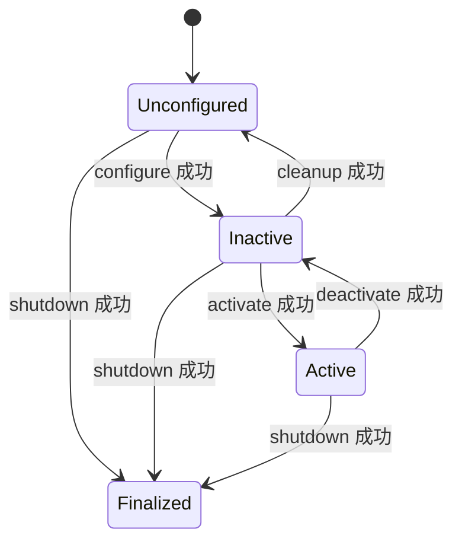

# Lifecycle：配送站开门了，设备就真的准备好了吗？

位置：[主线](../00_course_map.md)顺序 4。前一站：[状态机](../16_state_machine/README.md)；下一站：[行为树](../18_behavior_tree/README.md)。

状态：入门正文和 Humble 官方示例手册；本仓自有 Lifecycle 包与自动集成测试待实现。实际验证范围见[验证记录](../verification.md)。

## 第一遍读法与先记三件事

先看四个主状态，亲手执行 configure/activate/deactivate/cleanup；第二遍再看失败、错误和多节点管理。

1. 进程启动，只说明“店门开了”；参数、资源准备妥当，还需要检查。
2. 节点生命周期（Lifecycle）给准备、工作、停用和清理提供统一状态与管理接口。
3. Lifecycle 的 `active` 表示节点处于工作阶段，不代表某个配送订单已经成功。

类比：开店先检查电源和备料（configure），允许营业（activate），暂停接单（deactivate），收拾设备（cleanup）。边界：软件状态转换不是物理断电，也不是急停；是否停止设备、释放资源，要由实现负责。

## 四个主状态，先走成功路径



上图只画成功路径。`configuring`、`activating` 等是转换中的状态；转换回调的返回结果决定最终去向。总体模型见 [ROS 2 Managed Nodes 设计](https://design.ros2.org/articles/node_lifecycle.html)，实际 Humble 行为以对应版本实现为准。

| 操作 | 配送设备中的应用设计示例 | 不能据此推断什么 |
|---|---|---|
| configure | 校验参数、创建资源 | 不意味着已开始对外输出 |
| activate | 启用受管理的发布与工作入口 | 不意味着机器人已经到达目标 |
| deactivate | 禁止新任务、停用输出，协调停止已有工作 | 不意味着所有普通回调都自动停止 |
| cleanup | 释放配置阶段取得的资源 | 不意味着进程退出 |
| shutdown | 完成退出前的资源处理 | Finalized 与 OS 进程被销毁仍是不同层次 |

## 三个终端，看见“活着但没有发布”

在仓库根目录操作，每个终端先 source Humble。需要官方 `lifecycle` 包与 `ros2 lifecycle` CLI：

```bash
source /opt/ros/humble/setup.bash
ros2 pkg executables lifecycle
ros2 lifecycle --help
```

缺包先按 [Humble lifecycle 示例说明](https://github.com/ros2/demos/blob/humble/lifecycle/README.rst)准备环境。不要在本仓运行尚不存在的自有包名。

```bash
# 终端 A：可被管理的发送节点
ros2 run lifecycle lifecycle_talker
```

```bash
# 终端 B：观察实际收到的消息
ros2 run lifecycle lifecycle_listener
```

终端 C 不启动自动 `lifecycle_service_client`，避免它和手动命令同时改变状态。先猜：节点在列表里时，listener 是否一定能收到消息？

```bash
ros2 lifecycle nodes
ros2 lifecycle get /lc_talker
ros2 lifecycle list /lc_talker
```

预期状态为 `unconfigured`；`list` 显示当前可用转换。接着逐条执行，每条之后观察 A、B，再输入下一条：

```bash
ros2 lifecycle set /lc_talker configure
ros2 lifecycle get /lc_talker
ros2 lifecycle set /lc_talker activate
ros2 lifecycle get /lc_talker
ros2 lifecycle set /lc_talker deactivate
ros2 lifecycle get /lc_talker
ros2 lifecycle set /lc_talker cleanup
ros2 lifecycle get /lc_talker
```

| 操作后 | 预期状态 | 应观察的证据 |
|---|---|---|
| configure | inactive | A 的 timer 仍可能打印“未激活”，B 没有新发布样本 |
| activate | active | B 持续收到消息；样本编号与开始时刻可变化 |
| deactivate | inactive | 停用生效后不再产生新样本；已有在途/排队样本可能稍后到达 |
| cleanup | unconfigured | 本官方例子的 publisher 和 timer 已释放 |

关键反例：Humble 的官方 talker 在 `inactive` 时普通 timer 仍能执行，LifecyclePublisher 会阻止未激活时的发布。不能把设计里的“inactive 不工作”理解成框架冻结所有普通 timer、subscription、service 或工作线程。实现依据见 [Humble talker](https://github.com/ros2/demos/blob/humble/lifecycle/src/lifecycle_talker.cpp)与 [LifecyclePublisher](https://github.com/ros2/rclcpp/blob/humble/rclcpp_lifecycle/include/rclcpp_lifecycle/lifecycle_publisher.hpp)。

**可证伪练习**：回到 `unconfigured` 后直接 `activate`，预期拒绝/转换失败，状态仍为 `unconfigured`。再执行 `configure → activate` 才能继续。不要把“不允许转换”误诊为 DDS 网络故障。

**收尾**：在当前主状态运行以下命令，再在 A、B 用 `Ctrl+C` 结束进程。

```bash
ros2 lifecycle set /lc_talker shutdown
ros2 lifecycle get /lc_talker
```

预期状态 `finalized`；此命令不等价于操作系统杀死进程。无需删除系统文件，也不影响实际机器人。

**常见异常**：找不到 `/lc_talker` 时先核对 A 是否运行、名称是否重映射、Domain 是否一致；转换命令耗时要看是否处于转换状态和回调是否阻塞。检查 `list/get` 和示例日志，不以一条“进程已启动”日志作为可用证明。

## 第二遍：失败、错误和资源责任

以 `on_configure` 为例：返回 `SUCCESS` 进入 inactive；返回 `FAILURE` 回到 unconfigured；返回 `ERROR` 或转换回调抛出异常进入错误处理。其他转换的失败目标应查 Humble 对应转换规则，不能全部套用“回 unconfigured”。

错误处理状态（ErrorProcessing）不是第五个可自由添加的业务主状态。`on_error` 成功清理后可回到 unconfigured；清理失败会走 finalized。普通业务回调遇到故障，也不能假定框架会自动替应用完成节点故障恢复。

编写自有包时，按资源的实际获得/释放位置设计回调。覆写 `on_activate/on_deactivate` 后，要正确调用基类管理逻辑或显式管理对应 LifecyclePublisher；资源初始化一半失败时也要能清理。多线程下还需协调正在执行的回调，状态标志本身不是互斥锁。

## 第三遍：多个节点按依赖准备（后续实现练习）

模拟 `sensor → localization → navigation`：管理者先确认依赖节点配置并激活成功，再激活使用者。某一步失败就停止后续激活，按依赖逆序回退已完成部分，设置超时和有限重试，记录失败节点与转换。

Launch 启动顺序、固定 sleep 和 Lifecycle 就绪确认不能互相替代。管理者也需要故障策略；Lifecycle 不自动提供多节点事务或自动重启。自有包的后续验收应覆盖配置失败、重复启停、资源释放、节点掉线和部分激活后的回退。

## 过关

- [ ] 能走完 configure → activate → deactivate → cleanup，并从状态与数据两侧取证。
- [ ] 能解释节点 active 与业务 Delivering 可以同时存在且各管一件事。
- [ ] 能给出 inactive 下普通回调仍执行的反例。
- [ ] 能解释为什么一个节点启动失败时不能继续无条件启动后续任务。

下一站：[行为树](../18_behavior_tree/README.md)。
