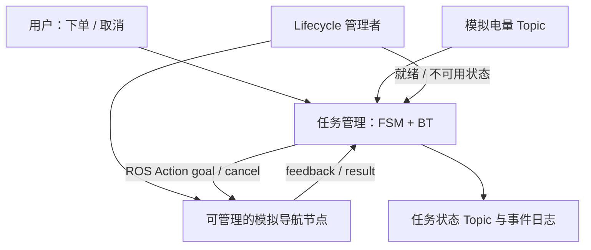

# 综合练习：先完成一单配送，再做通信工程

位置：[主线](00_course_map.md)顺序 6。前置：[ROS 2 基础](15_ros2_basics/README.md)、[FSM](16_state_machine/README.md)、[Lifecycle](17_lifecycle/README.md)、[BT](18_behavior_tree/README.md)。

**状态：本页是可实施的设计和验收清单，尚无集成 ROS 包或一键启动脚本。** 当前能运行的是[纯 C++ 概念实验](../labs/task_orchestration/README.md)和官方 ROS 示例。目标平台为 Ubuntu 22.04 / ROS 2 Humble / C++17，V1 全部使用模拟设备。

## V1：四个角色，完成最小闭环



这是职责图，不要求“一框一个进程”。初版先保持执行关系清楚，再讨论组合节点和多线程。任务管理者是目标的唯一写入者，BT 通过它提交导航请求，防止 FSM 与 BT 各自发一个相互竞争的目标。

| 管理对象 | 谁负责 | 典型状态/数据 | 不应塞进去的内容 |
|---|---|---|---|
| 一张订单 | FSM | Idle、Delivering、Canceling、Returning、Completed、Fault | 标准 Lifecycle 的 configure/cleanup |
| 一项配送策略 | BT | 检查电量、主路线、绕行、有限重试 | 底层电机控制循环 |
| 导航节点资源 | Lifecycle | unconfigured、inactive、active、finalized | 每张订单的业务进度 |
| 一次导航执行 | ROS Action | goal ID、反馈、结果、取消确认 | 仅用树节点的 RUNNING 代替远端状态 |

## 按四个增量实现（均为待实现）

1. **只配送成功**：模拟电量、导航 action、任务 FSM；记录订单 ID 和状态原因，节点未就绪时拒单。
2. **加入取消与时限**：Canceling 中停止提交新目标，确认旧目标终止后才能返航；结果回调检查目标 ID，忽略旧结果。
3. **加入 Lifecycle 管理**：依赖就绪才接单；激活失败停止后续启动并回退已激活部分；停用前协调正在运行的任务。
4. **加入 BT 策略**：替换配送阶段内部策略，测试主路线失败后绕行、低电量中断、重试耗尽；FSM 仍保留订单模式。

每个增量先能演示和解释再叠下一层。最初不需要真实底盘、地图、相机、Nav2 或 GPU。

## 用同一份日志回答发生了什么

每次事件记录：单调时钟时间、订单 ID、目标 ID（若已接受）、来源、事件、前状态、后状态、原因。跨机器时间不能直接相减；V1 先在同机验证。

```text
示意（不是已运行输出）：
order=42 event=OrderAccepted Idle -> Delivering
order=42 goal=g7 event=CancelRequested Delivering -> Canceling
order=42 goal=g7 event=CancelConfirmed Canceling -> Returning
order=42 goal=g8 event=Docked Returning -> Idle
```

电量至少记录值与新鲜度；“上次收到的 80%”不能永远当作当前安全条件。中断、停止确认、返航的策略与时间上限应明确记录，不能由多个回调各自猜测。

## 验收用例

| 注入/操作 | 必须观察到什么 | 能排除什么错误 |
|---|---|---|
| 正常下单 | 一个配送目标，反馈前进，成功到 Completed | 重复 goal、把接受误当完成 |
| Delivering 时取消 | Canceling → 收到终态确认 → Returning | 只改本地状态，旧目标仍执行 |
| goal 接受前取消 | 保存取消意图，接受后取消；不丢请求 | 空 handle 导致取消无效 |
| 途中电量降到阈值以下 | 下一次评估中断配送，按取消确认流程处理 | 前置条件只在开头检查一次 |
| 电量消息停止 | 超过定义时限后视为不可用 | 无限使用旧电量 |
| 主路线失败 | 尝试绕行；预算耗尽后明确失败 | 无限重试、RUNNING 被当失败 |
| 导航未激活 / 激活失败 | 拒单并记录原因；管理者执行有界回退 | 用进程存在代替就绪 |
| 执行中节点掉线 | 超时进入定义的故障状态，不无界等待 | 永远 RUNNING |
| 旧 goal 的迟到结果 | 日志记录忽略，不完成新订单 | 不核对目标 ID |
| 重复取消、重复清理 | 不重复发目标，不二次释放资源 | 非幂等副作用 |

每例都要提供运行命令、输入条件、状态日志、预期结果和停止方式。未来实现自动测试时重点断言这些可观察行为，而不是仅检查程序退出码。

## V2：把小闭环接入通信工程项目

V1 通过后再进入原 [Stage 14 通信工程项目](14_capstone/README.md)：增加大消息传感器、定位/控制负载、监控、DDS/SHM 对比、tracing 和多机故障注入。

这时问题会更具体：慢回调会不会拖住取消？旧电量来自 QoS 队列还是执行器积压？节点处于 active 为什么 Action 仍不可用？再回到 02～10 的通信深入课程，用证据定位。V2 不是状态机入门的先修要求。
